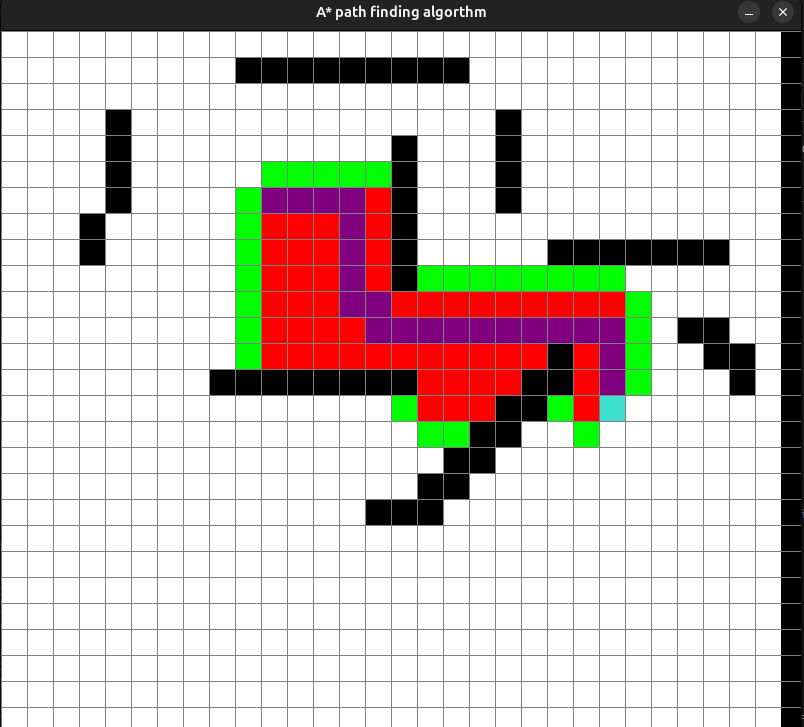

# Path finding algorithm 
- using A* with Manhattan Distance heuristic
- using BFS and DFS

# Guide
- Left click for starting point, right click for ending point then left click to create wall
- Press A for A*
- Press D for DFS
- Press B for BFS
- Press SPACE for maze generation

